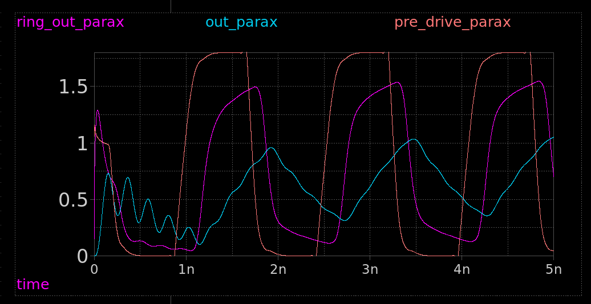

<!---

This file is used to generate your project datasheet. Please fill in the information below and delete any unused
sections.

You can also include images in this folder and reference them in the markdown. Each image must be less than
512 kb in size, and the combined size of all images must be less than 1 MB.
-->

## How it works

Aiming to create 2 ring oscillators at around 600MHz and 300MHz. The output will be quite attenuated due to the pad.

* Ring oscillator 1 is made of 18 inverters and a NAND gate for enable. 
* Ring oscillator 2 is made of 36 inverters and a NAND gate for enable. 

To get a good output current, a 2 stage inverter is used with large drive transistors.

* [Ring oscillator 1](https://xschem-viewer.com/?file=https%3A%2F%2Fgithub.com%2Fmattvenn%2Ftt08-analog-ring-osc%2Fblob%2Fmain%2Fxschem%2Fring.sch)
* [Ring oscillator 2](https://xschem-viewer.com/?file=https%3A%2F%2Fgithub.com%2Fmattvenn%2Ftt08-analog-ring-osc%2Fblob%2Fmain%2Fxschem%2Fring_2.sch)
* [Driver](https://xschem-viewer.com/?file=https://github.com/mattvenn/tt08-analog-ring-osc/blob/main/xschem/driver.sch)

The output waveform of the 600MHz is expected to be as shown in the cyan trace (out_parax). The ring_out_parax and pre_drive_parax are internal signals. See the xschem test bench for more details.

## How to test

* Enable 600 MHz oscillator 1 by setting user input pin 0 high and measure the signal at analog output 0.
* Enable 300 MHz oscillator 2 by setting user input pin 1 high and measure the signal at analog output 1.

## External hardware

Oscilloscope.
